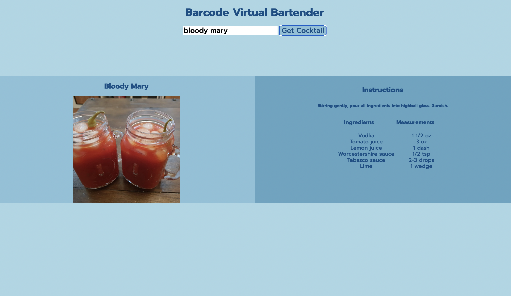

## Barcode: <a href="https://barcoderevised.netlify.app/">Live Demo</a>

## How It's Made:

**Tech used:** HTML, CSS, JavaScript

I used The Cocktail DB API to fetch data through the use of promises. Through the fetch function, I was able to input the path to the Cocktail DB API and return a promise to the response of that request. 

The user will enter a drink they would like to make into the input, then a fetch is made to the Cocktail DB API, which will return a response in json(). Then the value will be passed from the Promise into the .then as the data object. Through the data object, various keys and values can be identified. The values are rendered on the DOM using Javascript, HTML, and CSS. 

## Optimizations

If I had more time, I would fetch more information from the database and perhaps add another external API that includes videos of how to make the cocktails. The Cocktail DB API does not include videos on how to make the cocktails. Perhaps I could also add a list of drinks that can be made based on the type of alcohol and let the users choose the drink they would like to make. 

## Lessons Learned:

I learned how to fetch data from APIs, render that data onto the DOM, and also take input from users. I also brushed up on my CSS skills. Being able to take the input from the user and return the requested data, was a rewarding experience. 

